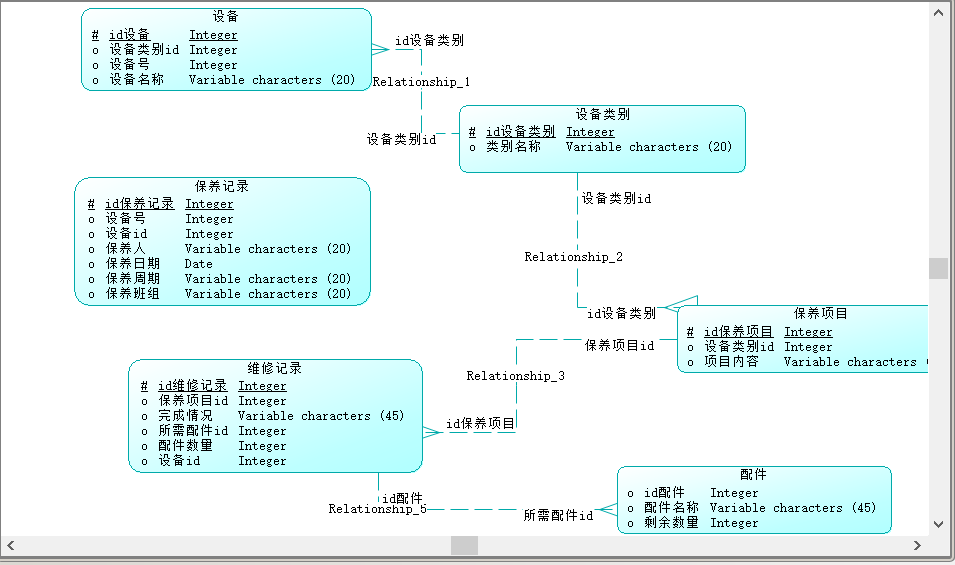
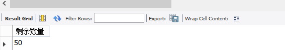
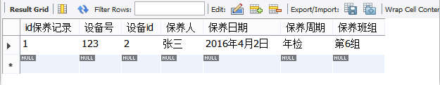
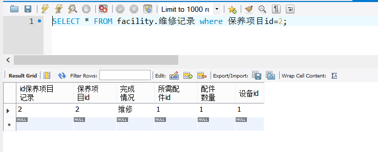

er图：

数据库查询语句：
/*
查询设备编号为1的材料消耗情况
*/
USE facility;
SELECT 配件.剩余数量
from 维修记录，配件
where 维修记录.所需配件id=1 AND 维修记录.所需配件id=配件.id配件；

/*
查询设备编号为1的保养情况
*/
USE facility;
select *
from 保养记录
where 保养记录.设备id=1 and 维修记录.保养项目id=保养设备.设备id;

/*
查询设备编号为1的维修情况
*/

